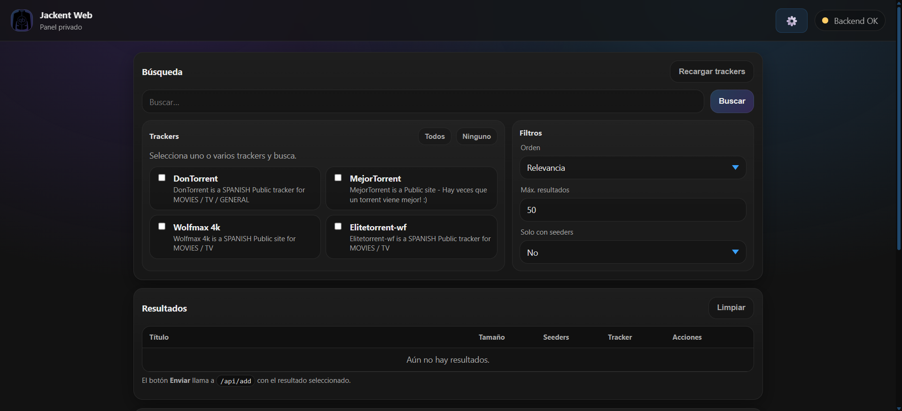
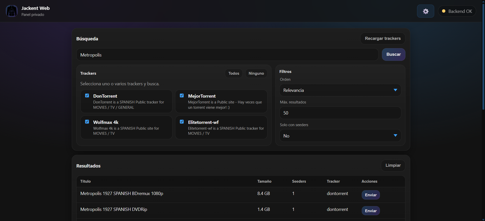

# 🎬 Jackent

<div align="center">


**Panel privado de búsqueda y descarga de torrents**

**Documentación:** https://miketroll.me/Jackent

Una aplicación web moderna que integra Jackett y qBittorrent para buscar y descargar contenido torrent directamente desde tu navegador.


*Vista principal de la aplicación*


*Búsqueda de torrents*

</div>

---

## 📋 Índice

- [Características](#-características)
- [Tecnologías](#️-tecnologías)
- [Requisitos Previos](#-requisitos-previos)
- [Instalación](#-instalación)
- [Uso](#-uso)
- [API](#-api)
- [Contribuir](#-contribuir)
- [Licencia](#-licencia)

---

## ✨ Características

### 🔍 Búsqueda Avanzada
- **Multi-tracker**: Busca simultáneamente en múltiples trackers de Jackett
- **Filtros inteligentes**: Ordena por relevancia, seeders, tamaño o fecha
- **Resultados en tiempo real**: Visualización instantánea de resultados
- **Solo con seeders**: Filtra resultados activos

### 📥 Gestión de Descargas
- **Integración con qBittorrent**: Añade magnets y torrents directamente
- **Descargas locales**: Los archivos se guardan en tu sistema (carpeta Descargas)
- **Organización automática**: Cada torrent se guarda en su propia carpeta
- **Acceso web a qBittorrent**: Gestiona tus torrents desde http://localhost:8080

### 🎨 Interfaz de Usuario
- **Diseño moderno**: UI limpia y profesional
- **Responsive**: Adaptable a móviles, tablets y desktop
- **Estado en tiempo real**: Indicador de conexión con los servicios
- **Acceso rápido**: Links directos a Jackett y qBittorrent

### 🔧 Características Técnicas
- **Dockerizado**: Fácil despliegue con Docker Compose
- **API REST**: Backend modular y escalable
- **Salud del sistema**: Endpoint de health check
- **CORS habilitado**: Acceso desde cualquier origen
- **Descargas persistentes**: Los archivos se guardan fuera del contenedor Docker

---

## 🛠️ Tecnologías

### Backend
- **Node.js** + **Express**: Servidor API REST
- **node-fetch**: Cliente HTTP para APIs externas
- **cors**: Manejo de Cross-Origin Resource Sharing
- **parse-torrent**: Parseo de archivos torrent
- **form-data**: Manejo de uploads multipart

### Frontend
- **HTML5** + **CSS3** + **JavaScript Vanilla**
- **Responsive Design**: Mobile-first approach

### Infraestructura
- **Docker** + **Docker Compose**: Containerización
- **Nginx**: Servidor web y reverse proxy
- **Jackett**: Meta-tracker de torrents
- **qBittorrent**: Cliente BitTorrent con interfaz web

---

## 📦 Requisitos Previos

Antes de comenzar, asegúrate de tener instalado:

- [Docker](https://www.docker.com/get-started) (v20.10 o superior)
- [Docker Compose](https://docs.docker.com/compose/install/) (v2.0 o superior)

---

## 🚀 Instalación

Sigue estos pasos para configurar el proyecto:

### 1. Clonar el repositorio

```bash
git clone https://github.com/MikeTrollYT/Jackent.git
cd Jackent
```

### 2. Levantar los servicios

```bash
docker compose up -d
```

Esto iniciará:
- **Jackett** en `http://localhost:9117`
- **Nginx + Frontend** en `http://localhost:7997`
- **Backend API** en puerto interno 3000

### 3. Configurar Jackett

1. Abre en tu navegador: **http://localhost:9117/**
2. Copia la **API Key** que aparece en la interfaz de Jackett
3. Configura tus trackers favoritos en Jackett

### 4. Configurar variables de entorno

Crea un archivo `.env` en la raíz del proyecto:

```bash
touch .env
```

Edita el archivo `.env` y añade tus credenciales:

```env
JACKETT_URL=http://jackett:9117
JACKETT_API_KEY=tu_api_key_de_jackett_aqui
QBITTORRENT_URL=http://qbittorrent:8080
QBITTORRENT_USERNAME=admin
QBITTORRENT_PASSWORD=adminadmin
```

### 5. Reconstruir el backend

```bash
docker compose up -d --build backend
```

### 6. ¡Listo! 🎉

Abre tu navegador en **http://localhost:7997** y disfruta de Jackent Web.

---

## 💡 Uso

### Búsqueda de Torrents

1. **Selecciona trackers**: Marca uno o varios trackers de la lista
2. **Escribe tu búsqueda**: Introduce el nombre del contenido que buscas
3. **Configura filtros**: Ajusta el orden, límite de resultados y filtro de seeders
4. **Busca**: Haz clic en "Buscar" o presiona Enter
5. **Explora resultados**: Revisa la lista de torrents encontrados

### Añadir a qBittorrent

1. En los resultados, haz clic en **"Enviar a qBittorrent"**
2. El sistema añadirá el torrent/magnet a qBittorrent
3. La descarga comenzará automáticamente

### Gestionar Descargas

1. Accede a qBittorrent en **http://localhost:8080**
2. Monitorea el progreso de tus descargas
3. Los archivos completados se guardan en la carpeta `Descargas`

### Acceder a los Archivos

1. Los archivos descargados están en `./Descargas`
2. Puedes acceder directamente desde tu sistema de archivos
3. Configura Plex/Jellyfin para acceder a esta carpeta

---

## 🔌 API

El backend expone los siguientes endpoints:

### `GET /health`
Verifica el estado de conexión con Jackett y qBittorrent.

**Respuesta:**
```json
{
  "jackett": { "status": "ok" },
  "qbittorrent": { "status": "ok" }
}
```

### `GET /links`
Obtiene las URLs de los paneles externos.

**Respuesta:**
```json
{
  "jackett": "http://localhost:9117",
  "qbittorrent": "http://localhost:8080"
}
```

### `GET /trackers`
Lista todos los trackers configurados en Jackett.

**Respuesta:**
```json
{
  "trackers": [
    {
      "id": "1337x",
      "name": "1337x",
      "type": "public"
    }
  ]
}
```

### `GET /search`
Busca torrents en los trackers seleccionados.

**Parámetros:**
- `q` (string): Término de búsqueda
- `trackers` (string): IDs de trackers separados por comas
- `sort` (string): `relevance`, `seeders`, `size`, `date`
- `limit` (number): Máximo de resultados
- `onlySeeded` (string): `yes` o `no`

**Respuesta:**
```json
{
  "results": [
    {
      "title": "Example Torrent",
      "seeders": 100,
      "leechers": 20,
      "size": "1.5 GB",
      "magnet": "magnet:?xt=urn:btih:..."
    }
  ]
}
```

### `POST /qbittorrent/add`
Añade un magnet/torrent a qBittorrent.

**Body:**
```json
{
  "raw": {
    "magnet": "magnet:?xt=urn:btih:..."
  }
}
```

### `GET /qbittorrent/torrents`
Lista todos los torrents en qBittorrent.

**Respuesta:**
```json
[
  {
    "hash": "abc123",
    "name": "Example Torrent",
    "progress": 0.45,
    "dlspeed": 1024000,
    "state": "downloading"
  }
]
```

### `DELETE /qbittorrent/delete/:hash`
Elimina un torrent de qBittorrent.

### `GET /qbittorrent/config`
Obtiene la configuración actual de auto-eliminación.

---

## 🤝 Contribuir

Las contribuciones son bienvenidas. Si quieres mejorar el proyecto:

1. Fork el repositorio
2. Crea una rama para tu feature (`git checkout -b feature/nueva-funcionalidad`)
3. Commit tus cambios (`git commit -am 'Añade nueva funcionalidad'`)
4. Push a la rama (`git push origin feature/nueva-funcionalidad`)
5. Abre un Pull Request

---

## 📝 Licencia

Este proyecto es de código abierto y está disponible bajo la licencia MIT.

---

## ⚠️ Disclaimer

Este proyecto es solo para fines educativos. Asegúrate de cumplir con las leyes de derechos de autor de tu país. Los desarrolladores no se hacen responsables del uso indebido de esta herramienta.

---

## 📧 Contacto

Si tienes preguntas o sugerencias, no dudes en abrir un issue en GitHub.

---

<div align="center">

⭐ Si te gusta el proyecto, ¡dale una estrella en GitHub!

</div>

